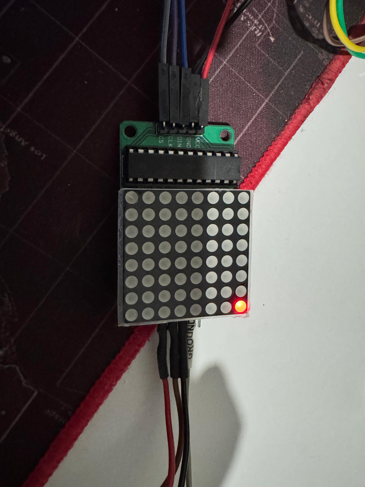

# PYNQ-Z2 Bring-Up Guide

This repo shows my first steps bringing up my [Tul PYNQ-Z2](https://www.tulembedded.com/fpga/ProductsPYNQ-Z2.html) board with the [official PYNQ image](https://dpoauwgwqsy2x.cloudfront.net/Download/pynq_z2_v3.0.1.zip), verifying PS–PL works, and running a custom fun LED blink pattern!

---

## What I did

1. Downloaded the official PYNQ-Z2 image.
2. Flashed it to a 16GB microSD card using Balena Etcher.
3. Booted the board and connected via UART & Ethernet.
4. Verified network & Jupyter Notebook.
5. Loaded the `base` overlay and ran my own Python LED blink notebook.

---

## Notebooks

- `fun_led_blink.ipynb`: simple Python notebook to test PS–PL LED control with a custom blink pattern.

---

## Screenshots
- [Putty boot log and ifconfig](screenshots/PuttyBootLog.png)
- [Jupyter Main Page](screenshots/JupyterMainPage.png)
- [Getting Started IPhython page](screenshots/GettingStartedPage.png)
- [Upload your script](screenshots/UploadToJupyter.png)
---
---


# SPI LED Matrix Project

This is my follow-up project for the PYNQ-Z2: using an AXI Quad SPI IP core in Vivado to control an 8x8 LED matrix (MAX7219) through PMODA with my own custom logic.


### What I did

1. Built a Vivado block design with PS–PL connection, AXI Quad SPI IP, and PMODA constraints.
2. Verified the SPI mode (CPOL=0, CPHA=0) and pin mapping.
3. Exported the `.bit` and `.hwh` files, then loaded the overlay on PYNQ.
4. Wrote a Jupyter notebook to send SPI commands to the MAX7219:
   - Initialized the display.
   - Tested basic LED rows and patterns.
   - Verified signals with a Logic 8 analyzer.

### Project Structure

```
.
├── notebooks/
│   ├── fun_led_blink.ipynb         # Original blink notebook
│   └── spi_led_matrix.ipynb        # New SPI LED Matrix notebook
├── resources/
│   ├── TUL_PYNQ_Schematic_R12.pdf  # Board schematics
│   ├── ds187-XC7Z010-XC7Z020-Data-Sheet.pdf
│   └── [vivado_exports]/           # .bit and .hwh files if shared
├── vivado/
│   ├── design_1_wrapper.bit        # Board schematics
│   ├── design_1_wrapper.hwh        # Board schematics
│   └── spi_pmod.xdc                # .bit and .hwh files if shared
├── captures/                       # Logic analyzer capture of spi transaction - use Saleae Logic software to open this file
├── screenshots/
│   ├── ...                         # Screenshots of Vivado, Jupyter, Logic Analyzer
└── README.md
```
### Step by step walkthrough:

#### 1. Create Vivado Project


#### 2. Select Board / Part
Choose your PYNQ-Z2 board from the Vivado board files. If not available, select the Zynq-7000 SoC XC7Z020-1CLG400 part manually.


once the project is created the main page will look like this:


#### 4. Create Block Design
- Open the IP Integrator.
- Create a new block design.


#### 5. Add Zynq Processing System
- Add the “ZYNQ7 Processing System” IP block.
- Run “Block Automation” to configure basic connections for DDR and FIXED_IO.


Double clioking the block will show this :


#### 6. Add AXI Quad SPI IP
Add the “AXI Quad SPI” IP block.


Run “Connection Automation” to link SPI to the Zynq PS via AXI Master.


#### 7. Create external connections for SPI signals
Expand the SPI_0 and right-click on io0_o, sck_o and ss_o[0:0] and select "Make External"


#### 8. Add Constraints
Add the pynq-z2.xdc constraints file. This includes the PMOD port mappings for your SPI pins.


Open the constraints file and paste the contents of vivado/spi_pmod.xdc into it.

```verilog
# Pin Connections

# PMODA Pin 1 → JA1P → LevelConverter LV4 → MAX7219 CS
# PMODA Pin 2 → JA1N → LevelConverter LV3 → MAX7219 CLK
# PMODA Pin 3 → JA2P → LevelConverter LV2 → MAX7219 DIN

# Schematics Reference Table 
# +------------+--------------------+------------------+----------------+
# | PMODA Sig  | FPGA Pin Name      | Package Pin      | Function       |
# +------------+--------------------+------------------+----------------+
# | JA1P       | IO_L17P_T2_34      | Y18              | CS             |
# | JA1N       | IO_L17N_T2_34      | Y19              | CLK            |
# | JA2P       | IO_L7P_T1_34       | Y16              | MOSI (DIN)     |
# +------------+--------------------+------------------+----------------+


# SPI Chip Select (CS) on PMODA JA1P Pin
set_property PACKAGE_PIN Y18 [get_ports ss_o_0[0]]
set_property IOSTANDARD LVCMOS33 [get_ports ss_o_0[0]]

# SPI Clock (CLK) on PMODA JA1N Pin
set_property PACKAGE_PIN Y19 [get_ports sck_o_0]
set_property IOSTANDARD LVCMOS33 [get_ports sck_o_0]

# SPI Data In (MOSI) on PMODA JA2P Pin
set_property PACKAGE_PIN Y16 [get_ports io0_o_0]
set_property IOSTANDARD LVCMOS33 [get_ports io0_o_0]

```

#### 9. Validate Design
Click “Validate Design” to check for connection issues.

#### 10. Create HDL Wrapper
Right-click on the block design and select Create HDL Wrapper. Let Vivado manage the wrapper automatically.

#### 11. Generate Bitstream
Click on Run Linter, Run Systhesis, Run Implementation first, once they are complete. Click on Generate Bitstream. 
Wait for synthesis, implementation, and bitstream generation to complete.

#### 12. Export Hardware
- After bitstream generation:
- Click File > Export > Export Hardware.
- Check “Include bitstream”.
- Save the .xsa file.

- The .bit file will be in the *.runs/impl_1 directory, copy it.
- Rename the .xsa to .zip and extract the .hwh files from the exported hardware folder for use with PYNQ.

#### 13. Copy to PYNQ
- Copy the generated .bit and .hwh files to your PYNQ-Z2’s directory via scp or Jupyter upload.
```bash
# Change <PYNQ_IP> to your boards ip address

scp design_1_wrapper.bit xilinx@<PYNQ_IP>:/home/xilinx/pynq/overlays/spi_test/
scp design_1_wrapper.hwh xilinx@<PYNQ_IP>:/home/xilinx/pynq/overlays/spi_test/
```

#### 14. Connection
Since PYNQ pins are 3.3v, we cannot directly connect them to the MAX7219 dot matrix led module (link in resources) which are 5v level. So get a level converter (link in resources to the one i used). 

```
PMODA Pin 1 → JA1P → LevelConverter LV4 → LevelConverter HV4 → MAX7219 CS
PMODA Pin 2 → JA1N → LevelConverter LV3 → LevelConverter HV3 → MAX7219 CLK
PMODA Pin 3 → JA2P → LevelConverter LV2 → LevelConverter HV2 → MAX7219 DIN

MAX7219 VCC -> Arduino Connector 5V (since there is only one 5v pin i had to solder this 5v to the level converter HV pin)

LevelConverter HV -> Arduino Connector 5V
LevelConverter LV -> Arduino Connector 3.3V

Gnd -> PMOD Gnd/ Arduino Connector GND(Pin 39) / Raspberry Pi Connectoir GND (Pin 39)
```



#### 15. Python code to control the dot matrix led
Check the python code in notebooks/max7219_led_matrix.ipynb

---


### Resources

- [PYNQ Official Docs](https://pynq.readthedocs.io/en/latest/)
- [MAX7219 Datasheet](https://datasheets.maximintegrated.com/en/ds/MAX7219-MAX7221.pdf)
- [Zynq TRM](https://docs.amd.com/r/en-US/ug585-zynq-7000-SoC-TRM)
- [Saleae Logic software](https://logic2api.saleae.com/download?os=windows&arch=x64)
- [3.3v <-> 5v level converter](https://www.amazon.com.au/dp/B0F3NDJQ9K?ref=ppx_yo2ov_dt_b_fed_asin_title)
- [Max7219 Dot matrix led module](https://www.amazon.com.au/dp/B0DBKL9CS9?ref_=ppx_hzsearch_conn_dt_b_fed_asin_title_1)


### Notes

- SPI signals use PMODA: JA1P/JA1N/JA2P mapped to CS, SCLK, DIN via level shifter.
- Verified correct SPI Mode 0 (CPOL=0, CPHA=0).
- All experiments captured with screenshots and Logic 8 trace for debug.

---


## Reference:
[Pynq Official docs](https://pynq.readthedocs.io/en/latest/pynq_sd_card.html)
[Zynq TRM](https://docs.amd.com/r/en-US/ug585-zynq-7000-SoC-TRM)

---
## License

MIT
